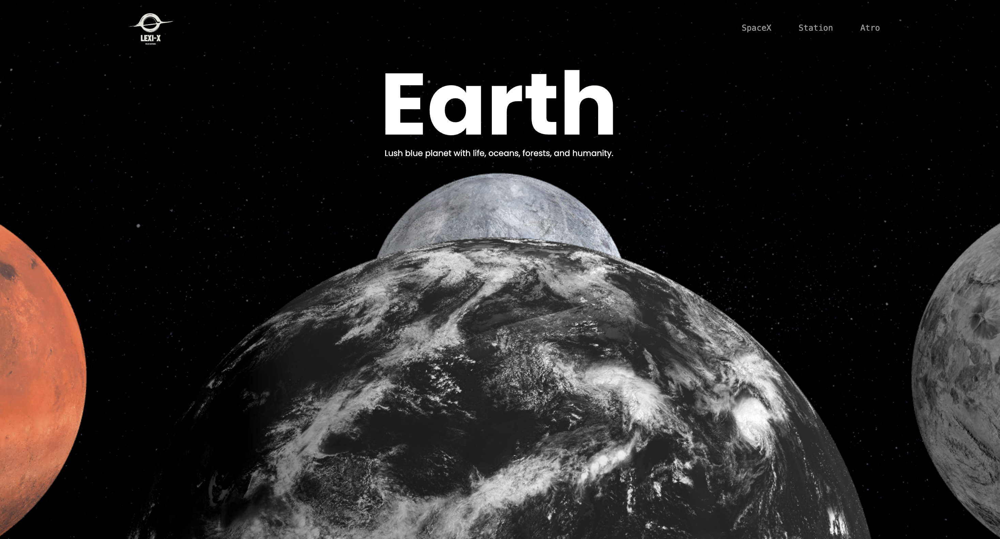

# 🚀 LexiX

**LexiX** is a visually engaging, space-inspired frontend application built using **Vite**, **Vanilla JavaScript**, **Tailwind CSS**, and **Three.js**.  
It showcases interactive 3D animations, scroll-triggered transitions, and a sleek modern UI — all without a backend.

---

## ✨ Features

- 🔭 Scroll-based 3D planetary rotation
- 🌌 Smooth animations with **GSAP**
- ⚡ Lightning-fast development powered by **Vite**
- 🎨 Fully responsive with **Tailwind CSS**
- 🎥 Real-time 3D rendering with **Three.js**
- 🧠 No frameworks — just clean, vanilla JavaScript

---

## 📸 Demo Preview

<!-- Replace the path below with your actual image or GIF path -->

> Want a GIF demo instead? Use `.gif` instead of `.png` in the link above.

---

## 🛠️ Tech Stack

| Tech           | Description                     |
|----------------|---------------------------------|
| Vite           | Build tool for fast development |
| Vanilla JS     | No frameworks, just JavaScript  |
| Tailwind CSS   | Utility-first CSS framework     |
| Three.js       | 3D graphics and animations      |
| GSAP           | Animation library               |

---

